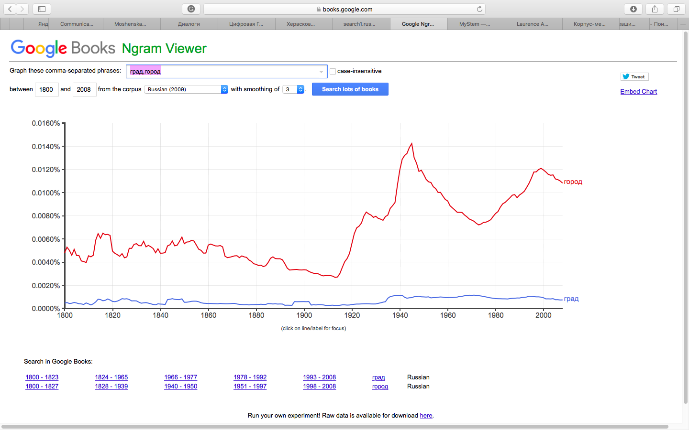
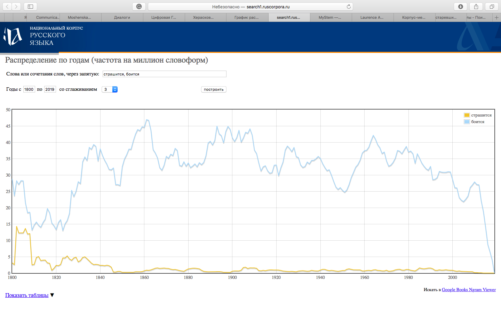
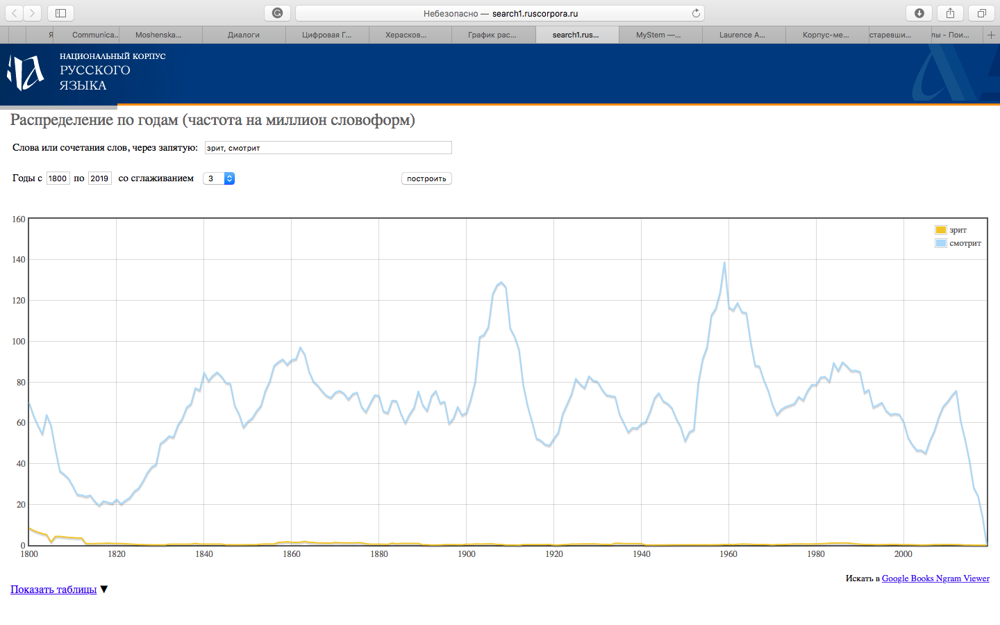
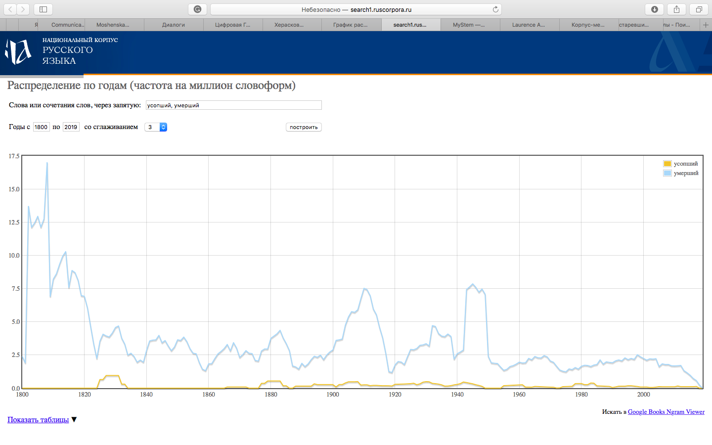
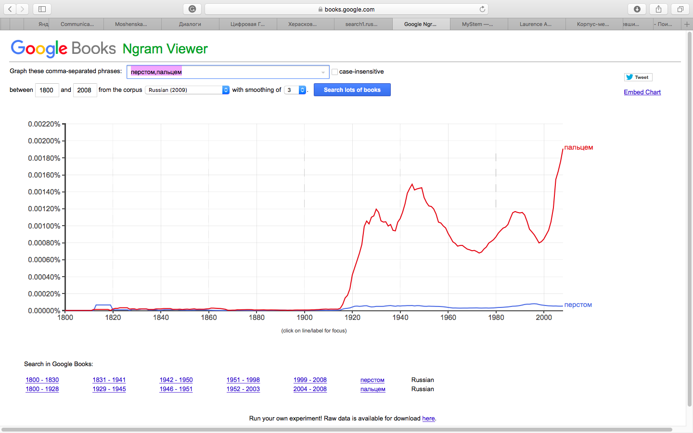

# HW3

1.1)
Input:
Мне страшно видеть в своём отражении проявившееся в последний год морщинки в уголках глаз и неглубокие полосы на лбу. Но отнюдь не от того, что я боюсь сделаться менее привлекательной. Дело не в том, что я считаю своё лицо особенно красивым, (я все же убеждена, что счастье моё зависит от поступков, но не внешности). Для меня неизбежное увядание красоты есть, в первую очередь, индикатор увядания организма в целом. Старение для меня - страшный процесс ухудшения разума, но не шелковистости кожи. Я боюсь того, что с возрастом мышление моё невозвратимо закостенеет, жизненные взгляды укрепятся, и я застряну в эпохе своего поколения - во времени первой половины двадцать первого века. Суть в том, что меня волнуют совсем другие изменения, нежели окружающих меня современниц, и потому, я, быть может, сильнее и тяжелее них переживаю быстротечность человеческой молодости.

Output:
{я} {страшно} {видеть} {в} {свой} {отражение} {проявляться} {в} {последний} {год} {морщинка} {в} {уголок} {глаз} {и} {неглубокий} {полоса} {на} {лоб}. {но} {отнюдь} {не} {от} {то}, {что} {я} {бояться} {сделаться} {менее} {привлекательный}. {дело} {не} {в} {то}, {что} {я} {считать} {свой} {лицо} {особенно} {красивый}, ({я} {весь} {же} {убеждать}, {что} {счастие} {мой} {зависеть} {от} {поступок}, {но} {не} {внешность}). {для} {я} {неизбежный} {увядание} {красота} {быть}, {в} {первый} {очередь}, {индикатор} {увядание} {организм} {в} {целое}. {старение} {для} {я} - {страшный} {процесс} {ухудшение} {разум}, {но} {не} {шелковистость} {кожа}. {я} {бояться} {то}, {что} {с} {возраст} {мышление} {мой} {невозвратимый} {закостеневать}, {жизненный} {взгляд} {укрепляться}, {и} {я} {застревать} {в} {эпоха} {свой} {поколение} - {во} {время} {первый} {половина} {двадцать} {первый} {век}. {суть} {в} {то}, {что} {я} {волновать} {совсем} {другой} {изменение}, {нежели} {окружать} {я} {современница}, {и} {потому}, {я}, {быть} {мочь}, {сильно} {и} {тяжело} {они} {переживать} {быстротечность} {человеческий} {молодость}.

1.4)

 

1.5)

1.6)

2.2)

ipm=6,4

ipm=9,2

ipm=2,7

ipm=0,34

ipm=1

ipm=5,1

ipm=3,8

ipm=0,5

ipm=0,01

ipm=1,1

ipm=2,8

ipm=1,3

ipm=0,1

ipm=0,3

ipm=0,001

ipm=2,3

ipm=0,6

ipm=0,5

ipm=0,2

ipm=1,5

ipm=2,3

ipm=0,03

ipm=0,1

ipm=0,1

